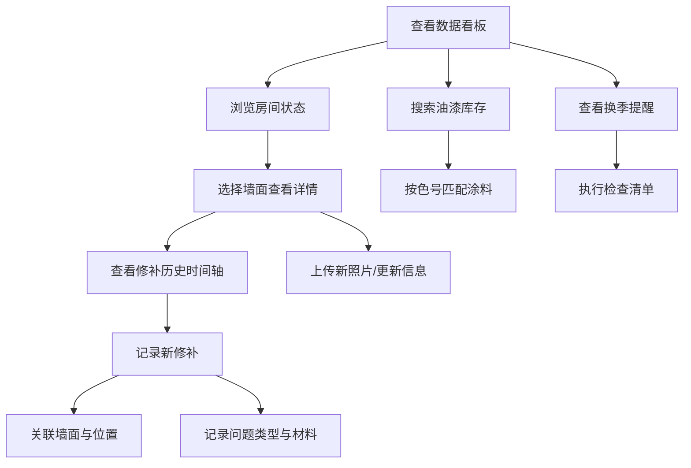

# 全屋墙面状态追踪系统 - 产品需求文档

## 1. 产品概述
全屋墙面状态追踪系统是面向家庭业主的墙面维护管理工具，解决墙面开裂、钉眼、起皮、发霉等问题缺乏系统记录的痛点，帮助用户避免补漆色差翻车和反复修补同一位置。
- 核心目标：建立每面墙的完整档案，追踪修补历史，管理油漆库存，提供季节性维护提醒
- 目标用户：注重家居品质、有墙面维护需求的家庭业主

## 2. 核心功能

### 2.1 用户角色
| 角色 | 注册方式 | 核心权限 |
|------|----------|----------|
| 家庭业主 | 本地使用 | 管理全部墙面档案、修补记录、油漆库存，查看数据看板 |

### 2.2 功能模块
1. **数据看板**：墙面健康概览、各房间最近修补时间、问题类型分布图、换季提醒通知
2. **墙面档案管理**：按房间录入墙面信息，材质/底漆/面漆品牌色号、施工信息、照片存档
3. **修补历史记录**：时间轴展示修补记录、问题类型标记、反复出问题区域高亮
4. **油漆库存管理**：剩余涂料品牌色号、开封日期、存放位置、快速搜索匹配
5. **季节性提醒**：换季墙面检查提醒、维护建议推送

### 2.3 页面详情
| 页面名称 | 模块名称 | 功能描述 |
|----------|----------|----------|
| 数据看板 | 健康概览卡片 | 展示墙面总数、待处理问题、本月修补数 |
| 数据看板 | 房间状态列表 | 各房间最近修补时间、问题数量、健康评分 |
| 数据看板 | 问题类型分布 | 饼图/柱状图展示裂缝、钉眼、空鼓、起皮、霉斑、污渍分布 |
| 数据看板 | 换季提醒区 | 显示当前季节提醒、检查清单 |
| 墙面档案 | 房间列表 | 按房间分类展示墙面卡片 |
| 墙面档案 | 墙面详情 | 材质、涂料信息、施工方、照片墙、色卡对比图 |
| 墙面档案 | 新增/编辑墙面 | 表单录入墙面各项信息、上传照片 |
| 修补历史 | 时间轴视图 | 按时间倒序展示修补记录，关联墙面和位置 |
| 修补历史 | 反复问题标记 | 高亮显示同一位置多次修补的记录 |
| 修补历史 | 新增修补记录 | 选择墙面、位置描述、问题类型、材料步骤 |
| 油漆库存 | 库存列表 | 剩余涂料信息、色号预览色块、开封日期 |
| 油漆库存 | 库存搜索 | 按品牌、色号、房间快速搜索匹配 |
| 油漆库存 | 新增/编辑库存 | 录入涂料信息、存放位置、剩余量 |

## 3. 核心流程
用户打开应用首先看到数据看板，了解全屋墙面整体健康状态；点击进入具体房间查看墙面档案，可录入新墙面或查看已有墙面详情；当墙面出现问题时，创建修补记录并关联具体墙面位置；使用库存中的涂料前可快速搜索匹配色号；换季时系统自动提醒进行墙面检查。

## 4. 用户界面设计

### 4.1 设计风格
- **主色调**：暖米色 (#F5F1E8) 背景搭配深青色 (#2D4A4E) 主色，辅助色为陶土红 (#C75B39) 用于警示和强调
- **视觉语言**：温馨家居风格，柔和圆角卡片、纸质质感、细腻微纹理背景
- **字体方案**：标题使用优雅衬线字体 "Noto Serif SC"，正文使用现代无衬线 "Noto Sans SC"
- **卡片风格**：软阴影、圆角 12px、轻微悬浮效果
- **图标风格**：线性风格 lucide-react 图标，配合暖色调

### 4.2 页面设计概览
| 页面名称 | 模块名称 | UI 元素 |
|----------|----------|----------|
| 数据看板 | 健康概览卡片 | 渐变背景卡片、大号数据指标、趋势箭头 |
| 数据看板 | 问题分布图 | 环形图 + 图例说明、色块对应问题类型 |
| 墙面档案 | 墙面卡片网格 | 缩略图预览、房间标签、健康状态指示器 |
| 墙面档案 | 墙面详情 | 双栏布局：左侧信息面板、右侧照片时间轴 |
| 修补历史 | 时间轴 | 垂直时间线、节点连接、问题类型色标 |
| 油漆库存 | 库存卡片 | 色号预览色块、开封天数标签、库存状态徽章 |

### 4.3 响应式设计
- 桌面端优先设计（1280px+），采用多栏布局
- 平板端（768px-1279px）：双栏布局，侧边栏折叠为图标
- 移动端（<768px）：单栏布局，底部Tab导航

### 4.4 动效设计
- 页面入场：卡片渐入 + 轻微上浮（staggered 延迟）
- 数据看板指标：数字滚动计数动画
- 时间轴：滚动触发节点渐显
- 悬停交互：卡片轻微上浮 + 阴影加深 + 边框高亮
