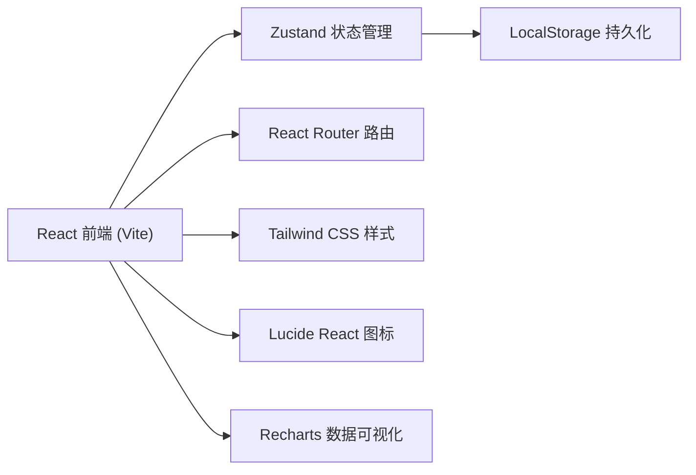
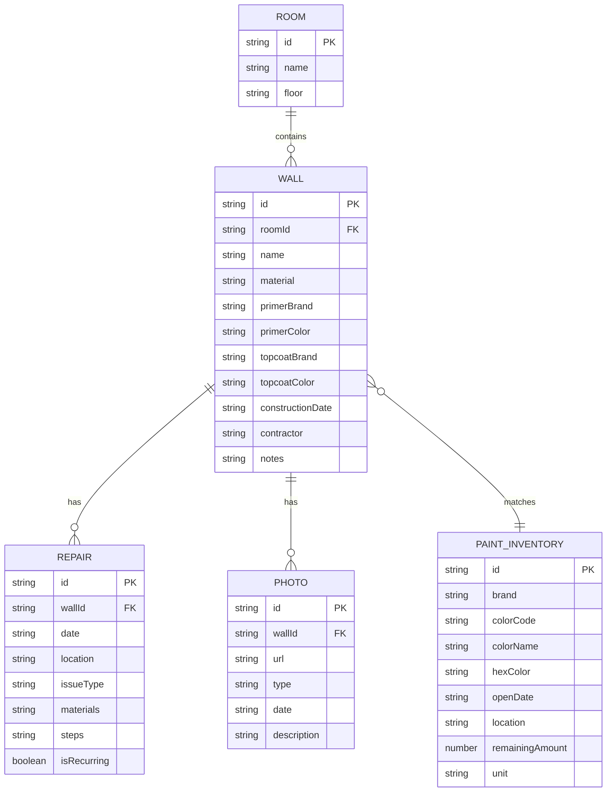

# 全屋墙面状态追踪系统 - 技术架构文档

## 1. 架构设计



## 2. 技术栈说明
- **前端框架**：React 18 + TypeScript
- **构建工具**：Vite 5
- **样式方案**：Tailwind CSS 3
- **状态管理**：Zustand
- **路由管理**：React Router DOM 6
- **图标库**：Lucide React
- **数据可视化**：Recharts
- **数据持久化**：LocalStorage（无需后端）
- **初始化工具**：vite-init

## 3. 路由定义
| 路由路径 | 页面名称 | 用途说明 |
|----------|----------|----------|
| / | 数据看板 | 墙面健康概览、问题分布、房间状态、换季提醒 |
| /walls | 墙面档案 | 房间列表、墙面卡片、墙面详情与编辑 |
| /walls/:id | 墙面详情 | 单墙面完整档案、修补历史、照片墙 |
| /repairs | 修补历史 | 全部修补记录时间轴、反复问题标记 |
| /inventory | 油漆库存 | 涂料库存管理、色号搜索、库存状态 |

## 4. 数据模型

### 4.1 数据模型定义



### 4.2 TypeScript 类型定义

```typescript
interface Room {
  id: string;
  name: string;
  floor: string;
}

type WallMaterial = '水泥砂浆' | '石膏板' | '硅藻泥' | '护墙板' | '其他';

interface Wall {
  id: string;
  roomId: string;
  name: string;
  material: WallMaterial;
  primerBrand: string;
  primerColor: string;
  topcoatBrand: string;
  topcoatColor: string;
  topcoatHex?: string;
  constructionDate: string;
  contractor: string;
  notes?: string;
  photos: Photo[];
}

type IssueType = '裂缝' | '钉眼' | '空鼓' | '起皮' | '霉斑' | '污渍';

interface Repair {
  id: string;
  wallId: string;
  date: string;
  location: string;
  issueType: IssueType;
  materials: string;
  steps: string;
  isRecurring?: boolean;
}

type PhotoType = '现状' | '色卡' | '修补前' | '修补后';

interface Photo {
  id: string;
  wallId: string;
  url: string;
  type: PhotoType;
  date: string;
  description?: string;
}

interface PaintInventory {
  id: string;
  brand: string;
  colorCode: string;
  colorName: string;
  hexColor: string;
  openDate: string;
  location: string;
  remainingAmount: number;
  unit: 'L' | 'ml' | 'kg';
}
```

## 5. 前端项目结构

```
src/
├── components/
│   ├── layout/
│   │   ├── Sidebar.tsx
│   │   └── Header.tsx
│   ├── dashboard/
│   │   ├── HealthOverview.tsx
│   │   ├── RoomStatusList.tsx
│   │   ├── IssueDistribution.tsx
│   │   └── SeasonalReminder.tsx
│   ├── walls/
│   │   ├── RoomCard.tsx
│   │   ├── WallCard.tsx
│   │   ├── WallDetail.tsx
│   │   └── WallForm.tsx
│   ├── repairs/
│   │   ├── RepairTimeline.tsx
│   │   ├── RepairCard.tsx
│   │   └── RepairForm.tsx
│   ├── inventory/
│   │   ├── PaintCard.tsx
│   │   ├── PaintSearch.tsx
│   │   └── PaintForm.tsx
│   └── shared/
│       ├── StatsCard.tsx
│       ├── EmptyState.tsx
│       └── Modal.tsx
├── pages/
│   ├── Dashboard.tsx
│   ├── Walls.tsx
│   ├── WallDetail.tsx
│   ├── Repairs.tsx
│   └── Inventory.tsx
├── store/
│   └── useStore.ts
├── types/
│   └── index.ts
├── utils/
│   ├── mockData.ts
│   ├── dateUtils.ts
│   └── colorUtils.ts
├── App.tsx
├── main.tsx
└── index.css
```

## 6. 状态管理设计

Zustand Store 结构：
```typescript
interface WallState {
  rooms: Room[];
  walls: Wall[];
  repairs: Repair[];
  photos: Photo[];
  inventory: PaintInventory[];
  
  // 墙面操作
  addWall: (wall: Omit<Wall, 'id' | 'photos'>) => void;
  updateWall: (id: string, data: Partial<Wall>) => void;
  deleteWall: (id: string) => void;
  
  // 修补操作
  addRepair: (repair: Omit<Repair, 'id'>) => void;
  updateRepair: (id: string, data: Partial<Repair>) => void;
  deleteRepair: (id: string) => void;
  
  // 库存操作
  addPaint: (paint: Omit<PaintInventory, 'id'>) => void;
  updatePaint: (id: string, data: Partial<PaintInventory>) => void;
  deletePaint: (id: string) => void;
  
  // 查询方法
  getWallsByRoom: (roomId: string) => Wall[];
  getRepairsByWall: (wallId: string) => Repair[];
  getRecurringIssues: () => Repair[];
  searchInventory: (query: string) => PaintInventory[];
}
```
